# D.A.T.A. 🖖

*Database Automation, Testing, and Alignment for Supabase projects*

"Captain, I am detecting anomalies in your database schema."

D.A.T.A. is what you get when you need an android-level precision tool for database operations. Like Lt. Commander Data himself, this CLI won't let you violate the Prime Directive of production safety

## Database Done Declaratively 

- **Migration Lifecycle**: `generate` → `test` → `promote` → `rollback`
- **Edge Functions**: Deploy, validate, and monitor Supabase Edge Functions
- **pgTAP Testing**: Run tests with coverage analysis and watch mode
- **Production Safety**: Double confirmations, dry-run mode, and safety rails

## Golden SQL

Don't write migrations, write declarations.  
Don't think in diffs, think in definitions.

With D.A.T.A., you just maintain a set of organized SQL modules that describe the desired database state.

"Computer, compile database schema." D.A.T.A. transcludes your SQL files in the right order for you, and double checks your setup while it does so. No more surprise errors, no more out-of-order errors.

D.A.T.A. takes care of diffing and generating migrations for you, with the precision of a positronic brain.

## Speaks Supabase

RLS? Edge functions? Storage? "I am fully versed in over 300 forms of database communication." D.A.T.A. speaks Supabase fluently. It's handled for you. Just write the code, check it in to git, pass your tests and let D.A.T.A. deploy for you.

## Safety First

Built-in production protection.
- Must pass tests before migrations allowed
- Required interactive confirmation to deploy to prod
- Auto-detects destructive SQL

## Opinionated DX

- Organize your SQL files
- No hand-written migrations
- Test your database
- Candidate migrations must pass tests before they go live
- Git-first means every deployment is from `main` and tagged
- This is how you should be doing it anyway

**D.A.T.A. makes the right way the ONLY way**. "Captain, that action would violate safety protocols." Developers literally cannot deploy incorrectly because D.A.T.A. won't let them.

Git-first means your schema is diffable, mergable, auditable. 

And the `git diff` approach for migrations becomes SO clean:

```bash
# Current prod is at data/prod/2025-08-28T10:15:00Z
# You've modified sql/tables.sql and sql/functions.sql

data db migrate generate --name add-notifications
# D.A.T.A. responds: "Analyzing database differentials..."
git diff data/prod/latest HEAD -- sql/ | 
  data-sql-parser | 
  data-migration-generator > migrations/add-notifications.sql

# The migration is EXACTLY what changed between deployments
# No database introspection needed
# No "golden schema" to maintain
# Just pure git diffs
```

This also means rollbacks are deterministic:

```bash
data db migrate rollback --to-previous
# "Captain, initiating temporal database reversion."
# Finds: data/prod/2025-08-28T10:15:00Z
# Generates: reverse migration from git diff
# Deploys: with confidence because git never lies
```

You're essentially turning deployments into git commits with extra validation.

## Sane Deployments

"The needs of production outweigh the needs of development." 


## Quick Start

```bash
# Install
npm install -g @purrfect-firs/data

# "Computer, prepare for database operations."
data db migrate generate

# "Running diagnostic protocols..."
data db migrate test

# "Captain, permission to engage production systems?"
data db migrate promote --prod

# "Red Alert! Initiating emergency rollback procedures."
data db migrate rollback --prod
```

## Installation

### Prerequisites

- Node.js >= 18.0.0
- Supabase CLI
- Local or remote Supabase project

### Install from npm

```bash
npm install -g @purrfect-firs/data
```

### Install from source

```bash
git clone https://github.com/yourusername/supa-data.git
cd supa-data
npm install
npm link
```

## Configuration

### Environment Variables

```bash
# Local Development
SUPABASE_URL=http://localhost:54321
SUPABASE_SERVICE_ROLE_KEY=your_local_service_key
SUPABASE_ANON_KEY=your_local_anon_key

# Production
PROD_SUPABASE_URL=https://your-project.supabase.co
PROD_SUPABASE_SERVICE_ROLE_KEY=your_prod_service_key
PROD_SUPABASE_ANON_KEY=your_prod_anon_key
```

### Configuration File (.datarc.json)

```json
{
  "test": {
    "minimum_coverage": 80,
    "test_timeout": 300,
    "output_formats": ["console", "junit"],
    "coverage_enforcement": true,
    "excluded_functions": ["internal_*", "migration_*"],
    "debounce_delay": 1000,
    "auto_compile": true
  }
}
```

## Core Commands

### Migration Workflow

```bash
# 1. Generate migration from SQL source files
data db migrate generate
data db migrate generate --dry-run  # Preview without saving

# 2. Test migration in isolated schema
data db migrate test
data db migrate test --keep-schema  # Keep test schema for debugging

# 3. Check migration status
data db migrate status

# 4. Promote to production
data db migrate promote --prod  # Requires confirmation

# 5. Rollback if needed
data db migrate rollback --prod

# Other migration commands
data db migrate history         # View migration history
data db migrate verify          # Verify migration integrity
data db migrate squash          # Combine multiple migrations
data db migrate clean           # Remove old migration artifacts

# Alternative: Use npm scripts
npm run migrate:generate
npm run migrate:test
npm run migrate:promote
npm run migrate:status
npm run migrate:rollback
```

### Edge Functions

```bash
# Deploy all functions
data functions deploy

# Deploy specific functions
data functions deploy checkout-handler webhook-processor

# Validate before deployment
data functions validate

# Check deployment status
data functions status

# Deploy with migration
data db compile --deploy-functions
```

### Testing with pgTAP

```bash
# Run all tests
data test run

# Run with coverage
data test coverage --enforce --min-coverage 80

# Watch mode for development
data test watch

# Generate test templates
data test generate --rpc get_user_profile
data test generate --rls posts --operation insert
data test generate --constraint users_email_unique

# CI/CD integration
data test ci-run --format junit --output results.xml
data test ci-coverage --enforce --min-coverage 80
```

### Database Operations

```bash
# Execute queries
# Note: query command syntax needs verification
data db query "SELECT * FROM users LIMIT 10"
data db query --file migration.sql

# Reset database (be careful!)
data db reset
data db reset --prod  # Requires typing "RESET PRODUCTION"

# Compile SQL sources
data db compile
```

## Safety Features

### Production Safeguards

- **Double Confirmation**: Production operations require explicit confirmation
- **Destructive Query Detection**: Automatically detects DROP, DELETE, TRUNCATE
- **Dry Run Mode**: Preview changes without applying them
- **Transaction Boundaries**: Operations wrapped in transactions (where supported)
- **Resource Cleanup**: Automatic cleanup of database connections and processes

### Process Management

D.A.T.A. includes robust process management via `ChildProcessWrapper`:
- Command whitelisting to prevent injection
- Automatic timeout and cleanup
- Cross-platform support (Unix/Windows)
- Zombie process prevention

## Architecture

### Event-Driven Design

Commands emit events that can be handled by different reporters:

```javascript
// Commands emit events
command.emit('progress', { message: 'Processing...' });
command.emit('success', { message: 'Complete!' });
command.emit('error', { message: 'Failed', error });

// Reporters listen and format output
reporter.attach(command);
```

### Command Hierarchy

- **Command**: Base class with event emission and logging
- **SupabaseCommand**: Commands that use Supabase API
- **DatabaseCommand**: Commands that need direct database access
- **TestCommand**: Commands for testing operations

## Extending D.A.T.A.

### Creating a New Command

```javascript
const { Command } = require('./lib/Command');

class MyCommand extends Command {
  static description = 'My custom command';
  
  async performExecute(args) {
    this.emit('start');
    
    try {
      this.progress('Doing something...');
      // Your logic here
      this.success('Done!');
      this.emit('complete');
    } catch (error) {
      this.error('Failed', error);
      this.emit('failed', { error });
      throw error;
    }
  }
}
```

### Registering the Command

```javascript
// In src/index.js
program
  .command('my-command')
  .description('My custom command')
  .action(async (options) => {
    const command = new MyCommand(config, logger, options.prod);
    const reporter = new CliReporter();
    reporter.attach(command);
    await command.execute();
  });
```

## Common Issues

### Issue: Supabase Connection Failed

```bash
Error: connect ECONNREFUSED 127.0.0.1:54321
```

**Solution**: Start your local Supabase instance

```bash
supabase start
```

### Issue: Missing Service Role Key

```bash
Error: SUPABASE_SERVICE_ROLE_KEY environment variable is required
```

**Solution**: Set your environment variables

```bash
export SUPABASE_SERVICE_ROLE_KEY=your_key_here
```

### Issue: Command Not Found

```bash
data: command not found
```

**Solution**: Install globally or use npx

```bash
npm install -g @purrfect-firs/data
# OR
npx @purrfect-firs/data [command]
```

### Issue: Test Schema Not Cleaned Up

**Solution**: Manually drop test schemas

```sql
-- Find orphaned test schemas
SELECT schema_name FROM information_schema.schemata 
WHERE schema_name LIKE '@data.tests.%';

-- Drop them
DROP SCHEMA "@data.tests.1234567890" CASCADE;
```

## Development

### Running Tests

```bash
# Run tests
npm test

# Watch mode
npm run test:watch

# Coverage
npm run test:coverage
```

### Debug Mode

```bash
# Enable debug output
DEBUG=1 data db query "SELECT 1"

# Verbose logging
VERBOSE=1 data db migrate test
```

## Known Issues

See [issues/README.md](issues/README.md) for a comprehensive list of known issues and planned improvements.

### Priority Issues Being Addressed

- Transaction boundaries for multi-step operations
- Retry logic for transient failures
- Parallel deployment for Edge Functions
- Unit and integration test coverage

## Contributing

1. Fork the repository
2. Create your feature branch (`git checkout -b feature/amazing-feature`)
3. Commit your changes (`git commit -m 'Add amazing feature'`)
4. Push to the branch (`git push origin feature/amazing-feature`)
5. Open a Pull Request

```mermaid

graph TD

subgraph "Traditional Migration Hell"

Dev1[Developer writes migration] --> Apply1[Apply to dev DB]

Apply1 --> Prod1[Deploy to production]

Prod1 --> Drift1[Schema drift over time]

Drift1 --> Mystery1[❓ What's in prod?]

end

subgraph "CLIPPER Golden SQL"

Golden[Golden SQL files] --> Commit[Git commit]

Commit --> Diff[Git diff vs prod tag]

Diff --> Clip[CLIP migration]

Clip --> Test[Test migration]

Test --> Deploy[Deploy + Tag]

Deploy --> Truth[Git tag = Production truth]

end

style Mystery1 fill:#ff6b6b

style Truth fill:#51cf66

style Golden fill:#ffd700

```



## License

MIT

---

*data - Because your database deserves better than `rm -rf /`* ⛰️
