# Deno Runtime Migration Execution Plan

*Generated by T.A.S.K.S v3 - Lt. Commander Data*  
*Stardate 2025.242 (2025-08-30)*

## Executive Summary

The D.A.T.A. system requires immediate migration from Node.js to Deno runtime to achieve Edge Function testing parity and resolve ES module complications. This plan details a systematic 14-18 hour migration utilizing rolling frontier execution for optimal efficiency.

**Critical Success Factor**: Edge Function import and testing capability in native Deno runtime.

## Mission Parameters

| Parameter | Value |
|-----------|-------|
| **Total Tasks** | 15 |
| **Total Dependencies** | 19 |
| **Critical Path Length** | 6 stages |
| **Estimated Duration** | 14-18 hours (rolling frontier) |
| **Resource Requirements** | 6 concurrent workers max |
| **Risk Level** | LOW (20%) |
| **Benefit** | CRITICAL (100%) |

## Execution Strategy: Rolling Frontier (Recommended)

### Why Rolling Frontier Over Wave-Based?

- **36% Faster**: 14-18 hours vs 22-28 hours
- **Better Utilization**: 75% average resource usage vs 50%
- **No Artificial Delays**: Tasks begin immediately when ready
- **Adaptive**: Responds to actual completion times
- **Continuous Progress**: No synchronization barriers

## Codebase Analysis

### Current State Assessment

```
Total JavaScript Files: 75
Total Lines of Code: ~12,000
Dependencies: 20 npm packages
Test Files: ~30 Vitest specs
Edge Functions: Cannot currently test (Node.js incompatible)
```

### Existing Components for Reuse (47% efficiency gain)

1. **Event-Driven Architecture**: EventEmitter pattern compatible with Deno
2. **Supabase Integration**: SDK works identically in Deno
3. **Command Pattern**: Architecture translates directly
4. **Error Handling**: Custom error types remain valid

### Required Replacements

| Node.js Component | Deno Replacement | Complexity |
|-------------------|------------------|------------|
| `fs.promises` | `Deno` APIs | Low |
| `child_process` | `Deno.Command` | Medium |
| `path` | `std/path` | Low |
| `dotenv` | `std/dotenv` | Low |
| Commander.js | Cliffy | Medium |
| Vitest | Deno.test | Medium |

## Phase-by-Phase Execution

### Phase 1: Foundation (Hour 0-1)
**Critical: Blocks all subsequent work**

#### P1.T001: Initialize Deno Project Structure
- Create `deno.json` with TypeScript configuration
- Set up `import_map.json` for package resolution
- Configure Git to ignore Deno cache
- **Success Gate**: `deno --version` executes successfully

### Phase 2: Core Libraries (Hour 1-3)
**Parallel Execution Possible**

#### P1.T002: Migrate Command Base Class
- Port EventEmitter functionality
- Establish TypeScript interfaces
- **Critical**: All commands depend on this

#### P1.T003: Configuration System
- Implement dotenv loading
- Type-safe configuration object

#### P1.T004: Path Resolution
- Simple std/path replacement

#### P1.T012: Dependency Mapping
- Map all npm packages to esm.sh
- Validate import resolution

### Phase 3: Command Infrastructure (Hour 3-6)

#### P1.T005: DatabaseCommand
- Extends migrated Command base
- Supabase client integration
- Transaction support

#### P1.T006: SupabaseCommand
- API client functionality
- Error handling preservation

### Phase 4: Critical Capabilities (Hour 6-12)

#### P1.T007: Test Runner Migration
- **Priority**: Enables Edge Function testing
- Subprocess handling with Deno.Command
- pgTAP execution support

#### P1.T008: Migration Command
- Database migration execution
- Rollback capability

#### P1.T014: Bulk Command Migration
- ~50 command files
- Systematic TypeScript conversion
- **Largest task**: 6 hours estimated

### Phase 5: Testing & Validation (Hour 10-14)

#### P1.T009: Test Suite Conversion
- Vitest → Deno.test migration
- Coverage reporting setup

#### P1.T010: Edge Function Testing 🎯
- **CRITICAL GOAL ACHIEVEMENT**
- Direct import capability
- Request/Response handling

### Phase 6: Build & Distribution (Hour 12-14)

#### P1.T011: Binary Compilation
- Single executable generation
- Target size: <50MB
- Cross-platform builds

#### P1.T013: CI/CD Updates
- GitHub Actions Deno support
- Automated testing pipeline

### Phase 7: Validation (Hour 14)

#### P1.T015: Final Validation
- Complete system verification
- Node.js artifact removal
- Migration success confirmation

## Resource Management

### Shared Resources & Constraints

```yaml
deno_cache:
  capacity: 3 concurrent
  tasks_requiring: 10
  strategy: Round-robin allocation
  
test_suite:
  capacity: 1 (exclusive)
  tasks_requiring: 3
  strategy: Sequential execution
  
git_repository:
  capacity: 1 (exclusive)
  tasks_requiring: 3
  strategy: Quick operations, minimal blocking
```

### Worker Pool Configuration

- **Minimum Workers**: 2
- **Maximum Workers**: 6
- **Specializations**:
  - Deno Expert: P1.T001, P1.T010, P1.T011
  - TypeScript Expert: P1.T002, P1.T014
  - Testing Expert: P1.T007, P1.T009

## Critical Path Analysis

```
P1.T001 (1h) → P1.T002 (2h) → P1.T005 (2.5h) → 
P1.T014 (6h) → P1.T011 (1h) → P1.T015 (1h)

Total Critical Path: 13.5 hours minimum
```

## Risk Mitigation

### High-Risk Points

1. **P1.T001 Failure**: Complete blocker - assign best engineer
2. **P1.T002 Issues**: Would block all command migrations
3. **P1.T010 Problems**: Core goal failure - have debugging ready

### Mitigation Strategies

- Keep `legacy-node` branch for 30-day rollback
- Checkpoint at 25%, 50%, 75% progress
- Type-check before each commit
- Test continuously during migration

## Success Validation Checklist

- [ ] Deno project initialized with import maps
- [ ] All commands migrated to TypeScript
- [ ] Tests converted and passing (>95% pass rate)
- [ ] **Edge Functions directly importable** ✨
- [ ] Binary compiles to <50MB
- [ ] CI/CD pipeline operational
- [ ] No node_modules directory exists
- [ ] No package.json required
- [ ] pgTAP tests execute correctly
- [ ] Full system validation passes

## Execution Timeline (Rolling Frontier)

```mermaid
gantt
    title Deno Migration Timeline (14 hours)
    dateFormat HH:mm
    axisFormat %H:%M
    
    section Foundation
    Deno Setup          :T001, 00:00, 1h
    
    section Core
    Command Base        :T002, after T001, 2h
    Config             :T003, after T001, 1h
    PathResolver       :T004, after T001, 1h
    Dependency Map     :T012, after T001, 2h
    
    section Commands
    DatabaseCommand    :T005, after T002, 2.5h
    SupabaseCommand    :T006, after T002, 2h
    Test Runner        :T007, after T002, 3h
    MigrateCommand     :T008, after T005, 3.5h
    
    section Migration
    Bulk Commands      :T014, after T005, 6h
    Test Conversion    :T009, after T007, 4h
    Edge Functions     :T010, after T007, 1.5h
    
    section Build
    Binary Compile     :T011, after T014, 1h
    CI/CD Update       :T013, after T011, 1h
    
    section Validate
    Final Check        :T015, after T011, 1h
```



## Command Sequences

### Initial Setup
```bash
# Create migration branch
git checkout -b deno-migration

# Initialize Deno
deno init

# Verify setup
deno --version
```

### Migration Verification
```bash
# Type checking
deno check src/**/*.ts

# Test execution
deno test

# Edge Function test
deno run --allow-all tests/edge-function-import.test.ts

# Binary compilation
deno compile --allow-all --output data src/index.ts
```

### Rollback (if needed)
```bash
git checkout main
git branch -D deno-migration
# OR keep for reference
git checkout -b legacy-node
git tag v1.0.0-final-node
```

## Post-Migration Benefits

1. **Immediate**:
   - ES module issues resolved
   - Edge Functions testable
   - Development unblocked

2. **Short-term**:
   - Single binary distribution
   - No npm install required
   - Faster CI/CD pipelines

3. **Long-term**:
   - Aligned with Supabase platform
   - Better performance
   - Simplified deployment

## Final Notes

*"The needs of the many outweigh the needs of the few."* - Spock

This migration serves the entire development team by removing critical blockers and enabling the primary goal of Edge Function testing. The logical path is clear, the risks are manageable, and the benefits are substantial.

**Recommendation**: Proceed with rolling frontier execution immediately. Assign your most experienced Deno developer to P1.T001 and P1.T002. Monitor resource contention closely. Maintain the legacy-node branch for safety.

*Migration plan analysis complete. All parameters within acceptable ranges. Proceeding to implementation phase would be... logical.*

---

**Lt. Commander Data**  
*Chief Operations Officer*  
*U.S.S. Enterprise NCC-1701-D*