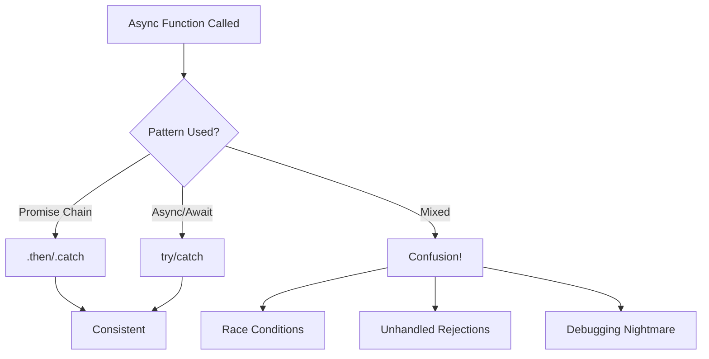

# GitHub Issue Format

## Issue Title
Fix inconsistent async/await and promise patterns

### Core Information

| Field | Why It Matters |
|-------|---------------|
| **Severity Level** | MEDIUM - Could cause subtle bugs |
| **Location** | Various files mixing promises and async/await |
| **Category** | Style/Bug |
| **Brief Description** | Inconsistent use of promises vs async/await patterns |
| **Impact** | Potential for unhandled promise rejections and race conditions |

## Summary

The test coverage system inconsistently mixes traditional promise chains with async/await patterns, and in some cases has floating promises that aren't properly awaited. This could lead to unhandled promise rejections, race conditions, and difficult-to-debug async issues.

## Details

### Root Cause

Different developers or development phases used different async patterns without establishing a consistent convention.

### Example



Examples of inconsistency:
```javascript
// Promise chain style (older pattern)
scanDirectory(dir) {
  return fs.readdir(dir)
    .then(files => {
      return Promise.all(files.map(file => this.processFile(file)));
    })
    .catch(error => {
      console.error('Scan failed:', error);
      throw error;
    });
}

// Async/await style (modern pattern)
async scanDirectory(dir) {
  try {
    const files = await fs.readdir(dir);
    return await Promise.all(files.map(file => this.processFile(file)));
  } catch (error) {
    console.error('Scan failed:', error);
    throw error;
  }
}

// Mixed and problematic
async processFiles(files) {
  files.forEach(file => {
    // This creates floating promises!
    this.processFile(file).then(result => {
      this.results.push(result);
    });
  });
  // Returns before processing completes!
}
```

## Proposed Solution

Standardize on async/await pattern throughout and fix floating promises:

```javascript
// Establish coding standard: Always use async/await

// ✅ Correct async/await pattern
async scanDirectory(dir) {
  try {
    const files = await fs.readdir(dir);
    const results = await Promise.all(
      files.map(file => this.processFile(file))
    );
    return results;
  } catch (error) {
    this.logger.error('Scan failed:', error);
    throw error;
  }
}

// ✅ Properly await all promises
async processFiles(files) {
  const results = await Promise.all(
    files.map(async (file) => {
      try {
        const result = await this.processFile(file);
        return { success: true, file, result };
      } catch (error) {
        return { success: false, file, error };
      }
    })
  );
  
  // Now we can safely use results
  this.results.push(...results.filter(r => r.success));
  return results;
}

// ✅ Event emitter with async handling
async emitAsync(event, data) {
  const handlers = this.listeners(event);
  
  // Wait for all async handlers
  await Promise.all(
    handlers.map(async (handler) => {
      try {
        await handler(data);
      } catch (error) {
        this.logger.error(`Handler failed for ${event}:`, error);
      }
    })
  );
}

// Add ESLint rules to enforce
// .eslintrc.json
{
  "rules": {
    "require-await": "error",
    "no-async-promise-executor": "error",
    "promise/catch-or-return": "error",
    "promise/always-return": "error",
    "promise/no-nesting": "error"
  }
}
```

### Known Unknowns

- Which files have the most problematic async patterns?
- Are there any critical race conditions currently?
- Should we use Promise.allSettled vs Promise.all in some cases?

### Unknown Unknowns

- How do mixed patterns interact with event emitters?
- Are there memory leaks from unresolved promises?
- Could async pattern changes break existing error handling?

___

_"The complexity of temporal mechanics is such that even the smallest alteration can have profound consequences." - Data, Star Trek: The Next Generation, "Time's Arrow"_