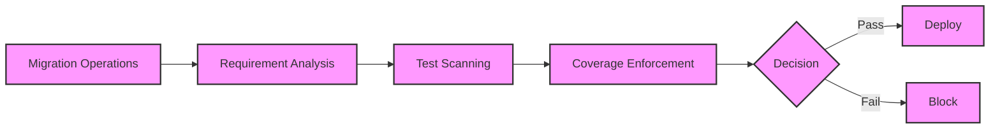

# GitHub Issue Format

## Issue Title
Add comprehensive end-to-end integration tests for coverage enforcement

### Core Information

| Field | Why It Matters |
|-------|---------------|
| **Severity Level** | HIGH - Quality assurance gap |
| **Location** | Missing test files for integration scenarios |
| **Category** | Testing |
| **Brief Description** | No comprehensive integration tests for full workflow |
| **Impact** | Integration bugs only discovered in production |

## Summary

The test coverage enforcement system lacks comprehensive integration tests that exercise the full workflow from migration analysis through coverage checking to deployment blocking. While unit tests exist for individual components, there's no testing of how these components work together in real scenarios.

## Details

### Root Cause

Development focused on unit testing individual components but didn't include integration testing for the complete workflow.

### Example

Missing test scenarios:


All these paths need integration testing!

## Proposed Solution

Create comprehensive integration test suite:

```javascript
// test/integration/coverage-enforcement.test.js

const { describe, it, expect, beforeEach, afterEach } = require('vitest');
const MigrationOrchestrator = require('../../src/lib/migration/MigrationOrchestrator');
const TestCoverageOrchestrator = require('../../src/lib/testing/TestCoverageOrchestrator');
const fs = require('fs').promises;
const path = require('path');

describe('Coverage Enforcement Integration', () => {
  let tempDir;
  let orchestrator;
  
  beforeEach(async () => {
    // Create temp directory structure
    tempDir = await createTempProject();
    
    orchestrator = new MigrationOrchestrator({
      sqlDir: path.join(tempDir, 'sql'),
      testsDir: path.join(tempDir, 'tests'),
      migrationsDir: path.join(tempDir, 'migrations'),
      skipTests: true,  // Skip unit tests, focus on coverage
      coverageEnforcementLevel: 'strict'
    });
  });
  
  afterEach(async () => {
    await cleanupTempProject(tempDir);
  });
  
  describe('Deployment Blocking', () => {
    it('should block deployment when coverage is insufficient', async () => {
      // Setup: Create SQL changes without tests
      await createSQLFile(tempDir, 'tables.sql', `
        CREATE TABLE users (
          id UUID PRIMARY KEY,
          email TEXT NOT NULL
        );
      `);
      
      // Act & Assert: Should throw coverage error
      await expect(orchestrator.performExecute())
        .rejects.toThrow(/Test coverage requirements not met/);
    });
    
    it('should allow deployment when coverage is sufficient', async () => {
      // Setup: Create SQL changes with tests
      await createSQLFile(tempDir, 'tables.sql', `
        CREATE TABLE users (id UUID PRIMARY KEY);
      `);
      
      await createTestFile(tempDir, 'users.test.sql', `
        SELECT has_table('users');
        SELECT has_column('users', 'id');
        SELECT col_type_is('users', 'id', 'uuid');
      `);
      
      // Mock the actual deployment
      orchestrator.executeMigration = jest.fn().mockResolvedValue(true);
      
      // Act & Assert: Should not throw
      const result = await orchestrator.performExecute();
      expect(result.success).toBe(true);
    });
  });
  
  describe('Coverage Calculation', () => {
    it('should correctly calculate coverage for complex schemas', async () => {
      // Setup: Complex schema with partial coverage
      await createSQLFile(tempDir, 'complex.sql', `
        CREATE TABLE posts (
          id SERIAL PRIMARY KEY,
          user_id UUID REFERENCES users(id),
          title TEXT NOT NULL,
          content TEXT
        );
        CREATE INDEX idx_posts_user ON posts(user_id);
        CREATE POLICY posts_policy ON posts FOR SELECT USING (true);
      `);
      
      await createTestFile(tempDir, 'posts.test.sql', `
        SELECT has_table('posts');
        SELECT has_column('posts', 'id');
        -- Missing: foreign key, index, and policy tests
      `);
      
      const coverageOrchestrator = new TestCoverageOrchestrator({
        testsDir: path.join(tempDir, 'tests')
      });
      
      const operations = [
        { sql: 'CREATE TABLE posts...', type: 'SAFE' }
      ];
      
      const result = await coverageOrchestrator.checkCoverage(operations);
      
      expect(result.coveragePercentage).toBeLessThan(50);
      expect(result.gaps).toContainEqual(
        expect.objectContaining({
          requirement: expect.objectContaining({
            type: 'index',
            name: 'idx_posts_user'
          })
        })
      );
    });
  });
  
  describe('Template Generation', () => {
    it('should generate valid templates for coverage gaps', async () => {
      // Setup: Schema without tests
      await createSQLFile(tempDir, 'functions.sql', `
        CREATE FUNCTION get_user(user_id UUID)
        RETURNS TABLE(email TEXT, created_at TIMESTAMP)
        AS $$ SELECT email, created_at FROM users WHERE id = user_id $$
        LANGUAGE SQL SECURITY DEFINER;
      `);
      
      const orchestrator = new TestCoverageOrchestrator({
        testsDir: path.join(tempDir, 'tests'),
        generateTemplates: true
      });
      
      const operations = [
        { sql: 'CREATE FUNCTION get_user...', type: 'SAFE' }
      ];
      
      const result = await orchestrator.checkCoverage(operations);
      
      expect(result.templates).toHaveLength(1);
      expect(result.templates[0].template).toContain('has_function');
      expect(result.templates[0].template).toContain('function_returns');
      expect(result.templates[0].template).toContain('is_definer');
    });
  });
  
  describe('Error Handling', () => {
    it('should handle corrupted test files gracefully', async () => {
      await createTestFile(tempDir, 'corrupt.sql', `
        This is not valid SQL {{{
      `);
      
      const scanner = new pgTAPTestScanner();
      
      // Should emit warning but not crash
      await scanner.scanDirectory(path.join(tempDir, 'tests'));
      
      const stats = scanner.getCoverageStatistics();
      expect(stats.errors).toBeGreaterThan(0);
    });
    
    it('should handle missing test directory', async () => {
      const orchestrator = new TestCoverageOrchestrator({
        testsDir: '/non/existent/path'
      });
      
      const result = await orchestrator.checkCoverage([]);
      
      // Should handle gracefully with warning
      expect(result.passed).toBe(true);
      expect(result.coveragePercentage).toBe(0);
    });
  });
});

// Helper functions
async function createTempProject() {
  const tempDir = path.join('/tmp', `data-test-${Date.now()}`);
  await fs.mkdir(tempDir, { recursive: true });
  await fs.mkdir(path.join(tempDir, 'sql'), { recursive: true });
  await fs.mkdir(path.join(tempDir, 'tests'), { recursive: true });
  await fs.mkdir(path.join(tempDir, 'migrations'), { recursive: true });
  return tempDir;
}

async function createSQLFile(tempDir, filename, content) {
  await fs.writeFile(path.join(tempDir, 'sql', filename), content);
}

async function createTestFile(tempDir, filename, content) {
  await fs.writeFile(path.join(tempDir, 'tests', filename), content);
}

async function cleanupTempProject(tempDir) {
  await fs.rm(tempDir, { recursive: true, force: true });
}
```

### Known Unknowns

- What are the most critical integration paths to test?
- How should we mock external dependencies?
- Should integration tests run against real PostgreSQL?

### Unknown Unknowns

- How will integration tests perform in CI/CD?
- Are there race conditions only visible in integration?
- How do we test production vs development behavior differences?

___

_"To properly test a system, one must examine not just its components, but how those components interact. The whole is often greater than the sum of its parts." - Data, Star Trek: The Next Generation, "Elementary, Dear Data"_