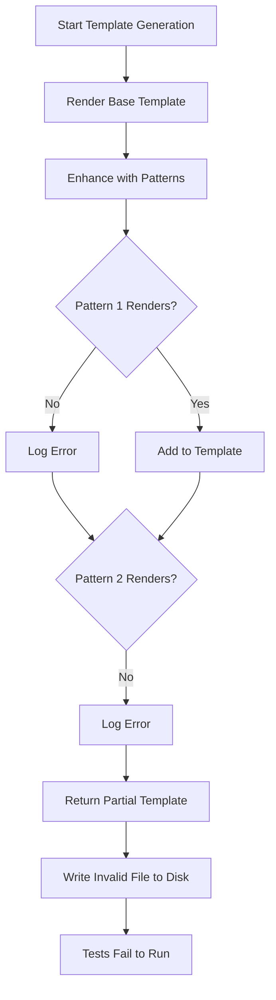

# GitHub Issue Format

> [!success] __This issuse has been fixed__

## Issue Title

Add error recovery for pattern rendering failures in TestTemplateGenerator

### Core Information

| Field | Why It Matters |
|-------|---------------|
| **Severity Level** | HIGH - Could leave test files in inconsistent state |
| **Location** | `src/lib/testing/TestTemplateGenerator.js` lines 545-597 |
| **Category** | Bug/Architecture |
| **Brief Description** | Pattern rendering failures lack proper error recovery |
| **Impact** | Failed template generation could leave partial or invalid test files |

## Summary

The TestTemplateGenerator's pattern enhancement system catches errors during pattern rendering but doesn't properly recover or rollback, potentially leaving generated templates in an inconsistent or invalid state. This could result in broken test files being written to disk.

## Details

### Root Cause

The error handling in `generateEnhancedTemplate` catches exceptions but continues processing, potentially returning partial templates:

```javascript
try {
  const pattern = this.patternLibrary.getPattern(patternName);
  if (pattern) {
    enhancedPatterns.push(this.renderPattern(patternName, variables));
  }
} catch (error) {
  // Error is swallowed, partial template continues!
  console.error(`Failed to render pattern ${patternName}:`, error);
}
```

### Example



## Proposed Solution

Implement proper error recovery with validation and rollback:

```javascript
async generateEnhancedTemplate(requirement, additionalPatterns = []) {
  const checkpoint = this.createCheckpoint();
  const errors = [];
  
  try {
    // Generate base template
    const baseTemplate = this.generateTemplate(requirement);
    if (!baseTemplate) {
      throw new Error('Failed to generate base template');
    }
    
    // Collect all pattern enhancements
    const enhancements = [];
    for (const patternName of additionalPatterns) {
      try {
        const rendered = this.renderPattern(patternName, variables);
        enhancements.push(rendered);
      } catch (error) {
        errors.push({ pattern: patternName, error });
        
        // Decide whether to continue or abort
        if (this.options.strictPatternRendering) {
          throw new Error(`Critical pattern rendering failure: ${patternName}`);
        }
      }
    }
    
    // Validate combined template
    const finalTemplate = this.combineTemplates(baseTemplate, enhancements);
    const validation = this.validateTemplate(finalTemplate);
    
    if (!validation.valid) {
      throw new Error(`Template validation failed: ${validation.errors.join(', ')}`);
    }
    
    return {
      template: finalTemplate,
      warnings: errors.map(e => `Pattern ${e.pattern} skipped: ${e.error.message}`)
    };
    
  } catch (error) {
    // Rollback to checkpoint
    this.rollbackToCheckpoint(checkpoint);
    
    // Re-throw with context
    throw new Error(`Template generation failed: ${error.message}`, { cause: error });
  }
}

validateTemplate(template) {
  const errors = [];
  
  // Check for required pgTAP structure
  if (!template.includes('CREATE OR REPLACE FUNCTION')) {
    errors.push('Missing function declaration');
  }
  
  if (!template.includes('SELECT plan(')) {
    errors.push('Missing test plan declaration');
  }
  
  if (!template.includes('SELECT finish()')) {
    errors.push('Missing test finish call');
  }
  
  // Check for SQL syntax (basic)
  try {
    // Could use pgsql-parser here for real validation
    this.basicSQLValidation(template);
  } catch (error) {
    errors.push(`SQL syntax error: ${error.message}`);
  }
  
  return {
    valid: errors.length === 0,
    errors
  };
}
```

### Known Unknowns

- What patterns are most likely to fail during rendering?
- Should we allow partial template generation with warnings?
- How should we handle disk I/O failures during template writing?

### Unknown Unknowns

- Could pattern rendering have side effects that need cleanup?
- Are there race conditions in concurrent template generation?
- How do different file systems handle partial writes?

___

_"It is the struggle itself that is most important. We must strive to be more than we are. It does not matter that we will not reach our ultimate goal. The effort itself yields its own rewards." - Data, Star Trek: The Next Generation, "The Offspring"_
