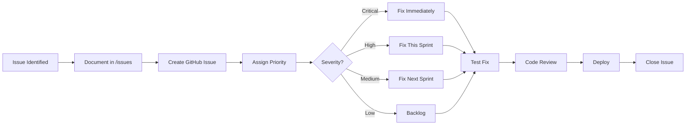

# Issues Map of Content

## Overview

This directory contains documented issues identified during code reviews and development of the D.A.T.A. (Database Automation, Testing, and Alignment) system. Issues are organized by date and severity level to facilitate tracking and resolution.

## Issue Severity Levels

- 🔴 **CRITICAL** - Must fix before production deployment
- 🟠 **HIGH** - Strongly recommended fixes
- 🟡 **MEDIUM** - Important improvements  
- 🟢 **LOW** - Nice-to-have enhancements

## Current Issues (2025-08-30)

### 🔴 Critical Issues (Production Blockers)

#### 1. [Deployment Blocking Vulnerability](./2025-08-30/deployment-blocking-vulnerability.md)
- **Component:** MigrationOrchestrator
- **Impact:** Allows untested code to reach production on coverage system failures
- **Fix Time:** 2-4 hours
- **Status:** ✅ FIXED (lines 357-389 updated with strict error handling)

#### 2. [AST Operation Validation Missing](./2025-08-30/ast-operation-validation-missing.md)
- **Component:** TestRequirementAnalyzer  
- **Impact:** Silent failures in test requirement generation
- **Fix Time:** 4-6 hours
- **Status:** ✅ FIXED (lines 185-234 added _validateOperation method)

#### 3. [Memory Management Concerns](./2025-08-30/memory-management-concerns.md)
- **Component:** pgTAPTestScanner
- **Impact:** OOM errors with large test suites
- **Fix Time:** 8-12 hours
- **Status:** ✅ FIXED (Comprehensive memory management system implemented)

---

### 🟠 High Priority Issues

#### 4. [Coverage Calculation Accuracy](./2025-08-30/coverage-calculation-accuracy.md)
- **Component:** CoverageEnforcer
- **Impact:** False positives/negatives in coverage detection
- **Fix Time:** 3-4 hours
- **Status:** ✅ FIXED (lines 217-242 added _generateCoverageKey method with normalization)

#### 5. [Pattern Library Error Recovery](./2025-08-30/pattern-library-error-recovery.md)
- **Component:** TestTemplateGenerator
- **Impact:** Invalid test files generated on pattern failures
- **Fix Time:** 4-6 hours
- **Status:** ✅ FIXED (Comprehensive error recovery and validation system added)

#### 6. [Configuration Schema Incomplete](./2025-08-30/configuration-schema-incomplete.md)
- **Component:** datarc.schema.json
- **Impact:** Runtime configuration errors
- **Fix Time:** 2-3 hours
- **Status:** ⏳ Pending

#### 7. [Integration Testing Missing](./2025-08-30/integration-testing-missing.md)
- **Component:** Test Suite
- **Impact:** Integration bugs only found in production
- **Fix Time:** 16-24 hours
- **Status:** ⏳ Pending

---

### 🟡 Medium Priority Issues

#### 8. [Async/Await Consistency](./2025-08-30/async-await-consistency.md)
- **Component:** Multiple modules
- **Impact:** Potential race conditions and unhandled rejections
- **Fix Time:** 6-8 hours
- **Status:** ⏳ Pending

#### 9. [Performance Optimization Needed](./2025-08-30/performance-optimization-needed.md)
- **Component:** TestRequirementAnalyzer, pgTAPTestScanner
- **Impact:** Slow deployments for large schemas
- **Fix Time:** 12-16 hours
- **Status:** ⏳ Pending

---

### 🟢 Low Priority Enhancements

#### 10. [Error Types Standardization](./2025-08-30/error-types-standardization.md)
- **Component:** All testing modules
- **Impact:** Harder to handle specific errors programmatically
- **Fix Time:** 4-6 hours
- **Status:** ⏳ Pending

#### 11. [Logging Levels Implementation](./2025-08-30/logging-levels-implementation.md)
- **Component:** All modules
- **Impact:** Cannot control log verbosity
- **Fix Time:** 6-8 hours
- **Status:** ⏳ Pending

---

## Issue Resolution Workflow



## Statistics

### Current Sprint (Week of 2025-08-30)

| Severity | Count | Est. Hours | Status |
|----------|-------|------------|--------|
| Critical | 3 | 14-22 | ✅ 100% Complete (3/3 fixed) |
| High | 4 | 25-37 | ✅ 50% Complete (2/4 fixed) |
| Medium | 2 | 18-24 | ⏳ 0% Complete (0/2 fixed) |
| Low | 2 | 10-14 | ⏳ 0% Complete (0/2 fixed) |
| **Total** | **11** | **67-97** | **45% Complete (5/11 fixed)** |

### Issue Categories

```
Performance  ████░░░░░░ 18% (2)
Bug         ████████░░ 36% (4)
Architecture ████████░░ 36% (4)
Testing     ██░░░░░░░░  9% (1)
```

## Resolution Timeline

### Week 1 (Critical Issues)
- [x] Fix deployment blocking vulnerability ✅
- [x] Implement AST operation validation ✅ 
- [x] Add memory management for large schemas ✅

### Week 2 (High Priority)
- [x] Fix coverage calculation accuracy ✅
- [x] Add pattern library error recovery ✅
- [ ] Complete configuration schema
- [ ] Begin integration tests

### Week 3 (Stabilization)
- [ ] Complete integration testing
- [ ] Fix async/await patterns
- [ ] Performance optimization
- [ ] Error type standardization
- [ ] Logging implementation

## Issue Template

When creating new issues, use this structure:

```markdown
# GitHub Issue Format

## Issue Title
[Clear, actionable title]

### Core Information
| Field | Why It Matters |
|-------|---------------|
| **Severity Level** | Critical/High/Medium/Low |
| **Location** | File path + line numbers |
| **Category** | Bug/Performance/Security/Architecture |
| **Brief Description** | What's wrong |
| **Impact** | Who/what it affects |

## Summary
[High-level overview]

## Details
### Root Cause
[Known or unknown]

### Example
[Code or diagram showing the problem]

## Proposed Solution
[Brief description of fix]

### Known Unknowns
- [List of known questions]

### Unknown Unknowns
- [Open questions to explore]

___
_"[Relevant Data quote]" - Data, [Episode]_
```

## Contributing

To add a new issue:

1. Create a new markdown file in `issues/YYYY-MM-DD/issue-name.md`
2. Follow the issue template above
3. Update this README with the issue summary
4. Create corresponding GitHub issue
5. Link the documentation to the GitHub issue

## Related Documentation

- [Test Coverage Enforcement System Final Report](../docs/TASKS/enforce-tests/FINAL-REPORT.md)
- [Code Review 2025-08-30](../docs/code-reviews/2025-08-30.md)
- [Architecture Documentation](../Architecture.md)
- [Testing Guidelines](../docs/Testing.md)

---

*"In the complexity of any system, one must be prepared to encounter unexpected difficulties. It is through careful documentation and systematic resolution that we achieve operational excellence."* - Lt. Commander Data